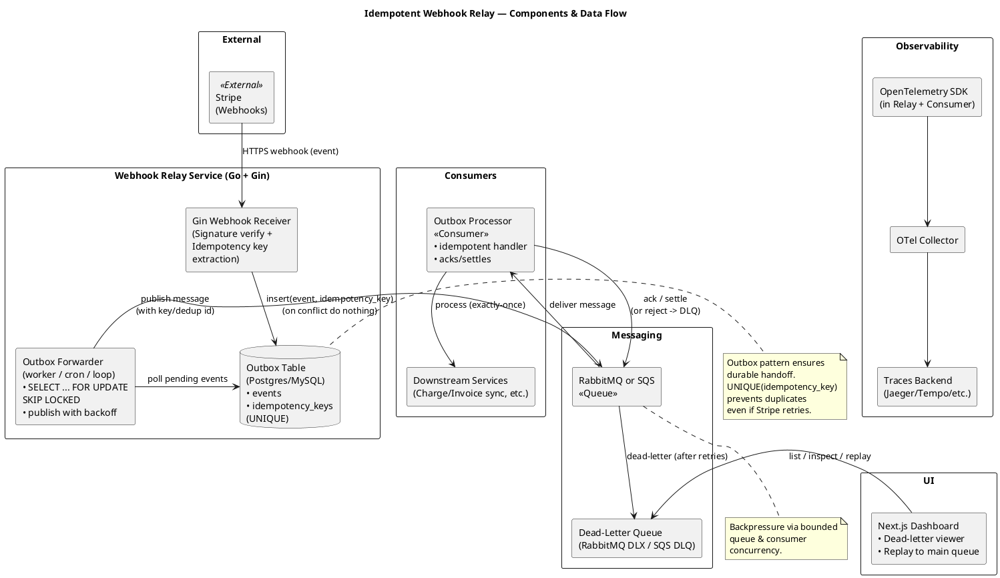
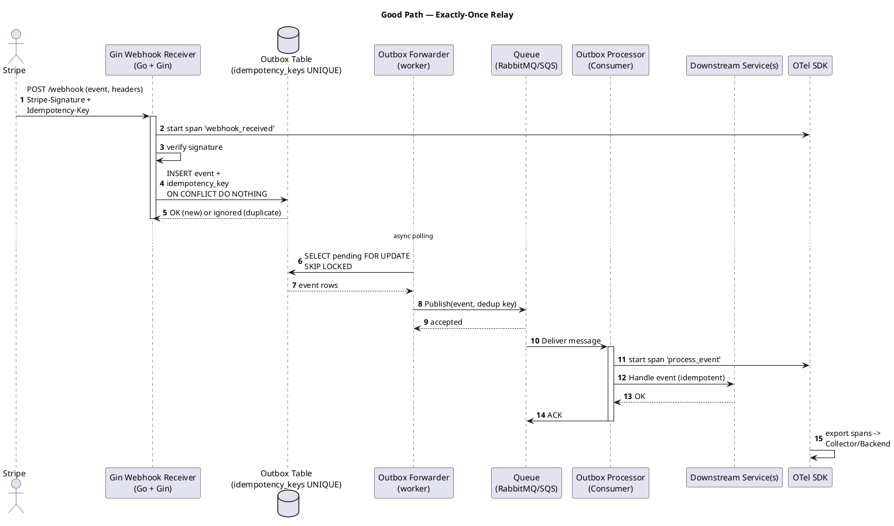
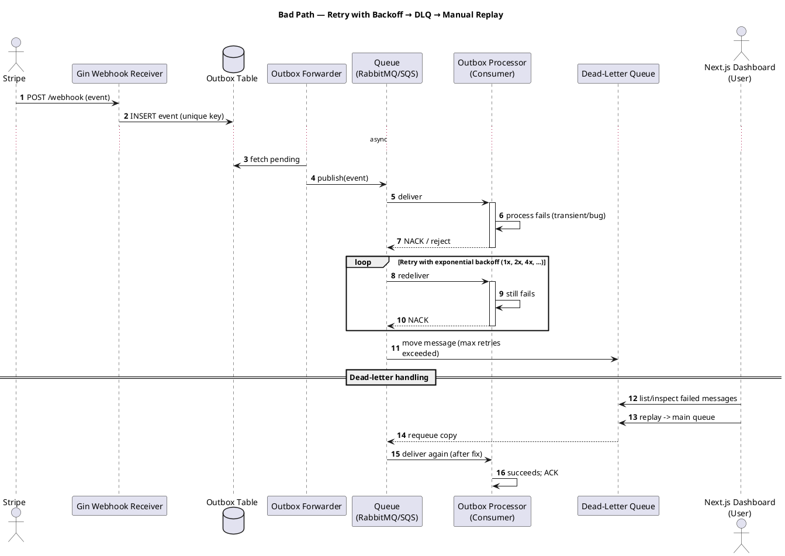

# Idempotent Webhook Relay

## Build

Receive Stripe test webhooks, store idempotency keys, retry with backoff to downstream “consumer” services, dead-letter UI.

## Stack

Go + Gin, outbox table, SQS/RabbitMQ, small Next.js dashboard.

## Showcase

Exactly-once semantics, backpressure, outbox pattern, tracing with OpenTelemetry.

# Architecture

## Component / Flow Diagram

## Sequence — “The Good”: exactly-once happy path

## Sequence — “The Bad”: retries, backoff, and dead-letter UI

